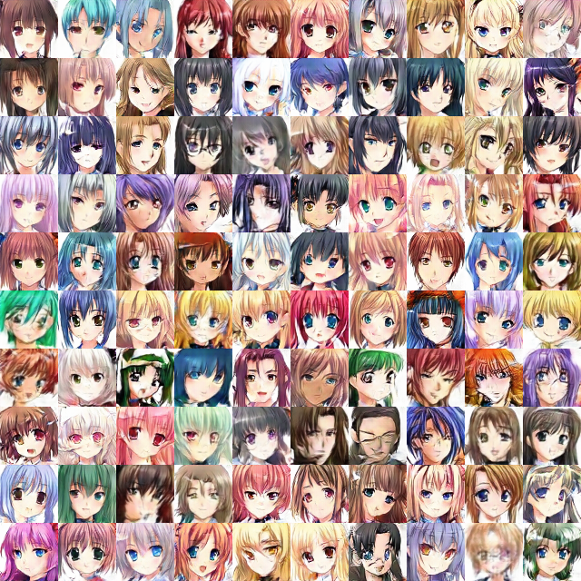
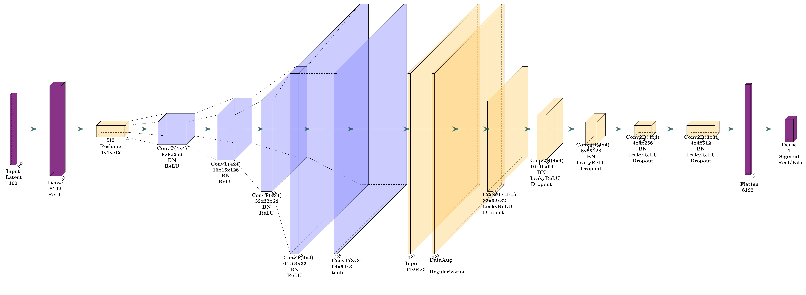
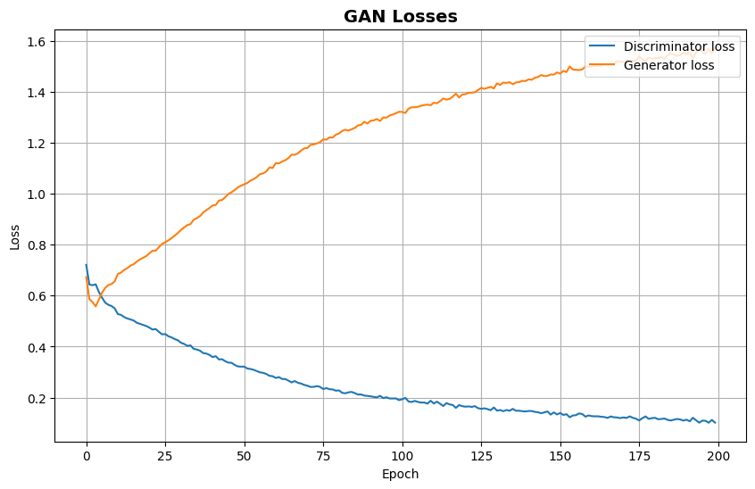
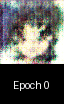
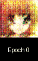
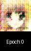
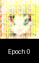
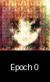
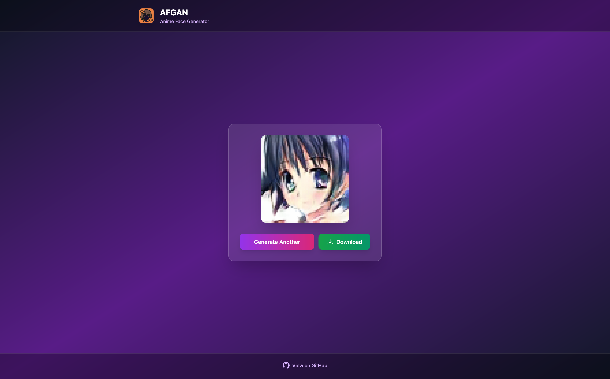

<div align="center">
   
   <h1><b>AFGAN</b></h1>
   <p><i>~ Generate & use! ~</i></p>
</div>

<div align="center">
   <a href="https://github.com/StafLoker/afgan/releases"></a>
   <a href="https://github.com/StafLoker/afgan/pkgs/container/afgan"></a>
   <a href="https://github.com/StafLoker/afgan/releases"></a>
   <a href="https://github.com/StafLoker/afgan/blob/main/LICENSE"><a>

   <p>Minimalist web server for generating anime faces using AFGAN (Anime Face GAN).</p>


</div>

## Quick Start

**Docker**
```bash
docker pull ghcr.io/stafloker/afgan:latest
docker run -p 80:38880 ghcr.io/stafloker/afgan:latest
```

**Docker Compose**
```bash
docker-compose up
```

## Model architecture

DFGAN ( like DCGAN ).

<div align="center">
   
</div>

## Training
### Loss
<div align="center">
   
</div>

### History
<div align="center">
   
   
   
   
   
</div>

## Screenshots

<div align="center">
   
</div>

## Contributing

Contributions are welcome! Please read the contributing guidelines and submit pull requests for any improvements.

## License

This project is licensed under the terms specified in the LICENSE file.